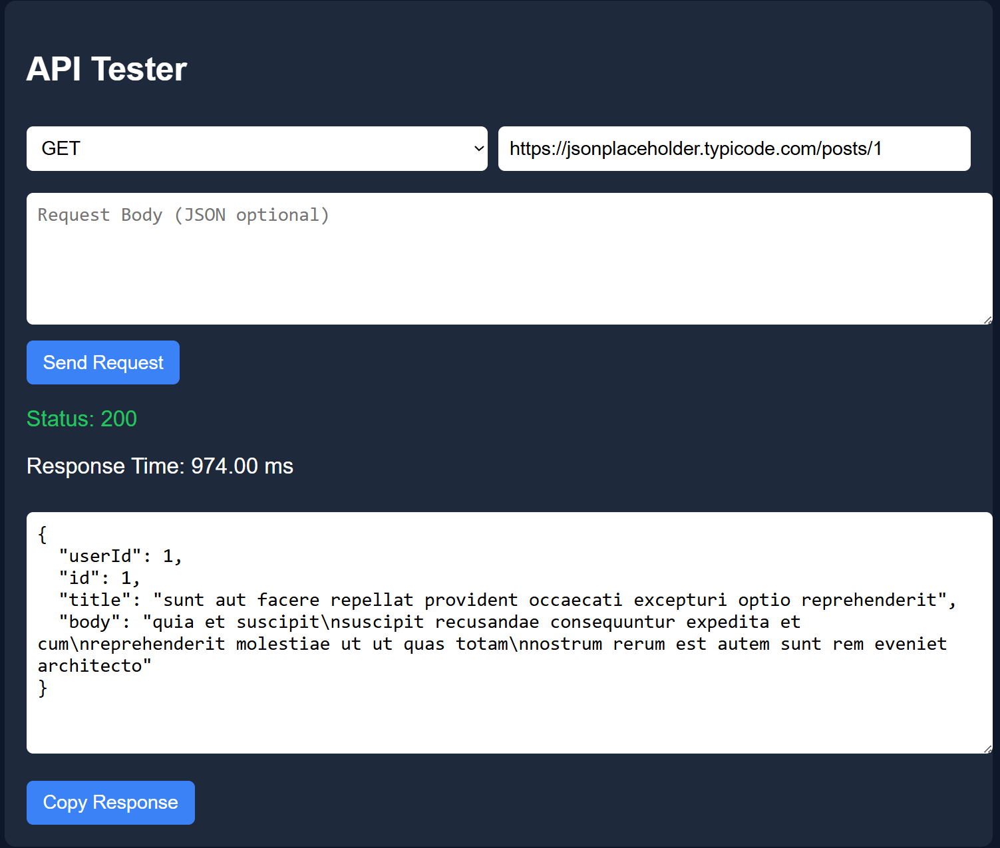
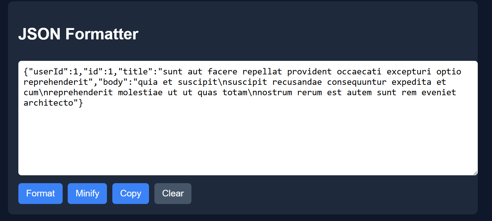
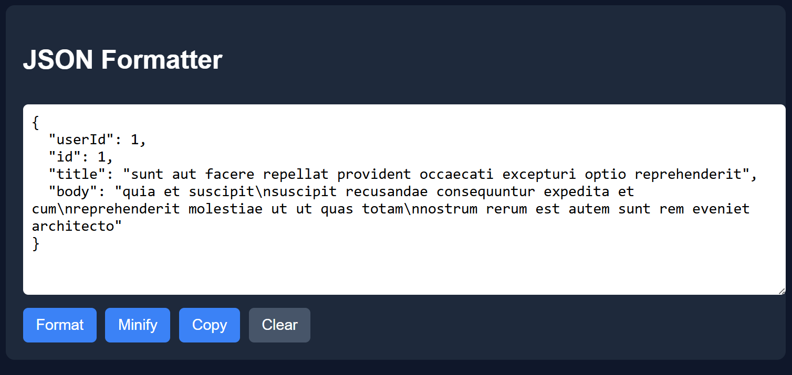

# DevTool ⚙️

A lightweight developer utility for formatting JSON and testing APIs.

## Features

- JSON Formatter
- JSON Minifier
- Copy JSON
- Safe Clear with confirmation
- API Request Tester
- Response status indicator
- Response time measurement
- Pretty JSON response viewer

## Tech Stack

- React
- Vite
- JavaScript
- CSS

## Example API

https://jsonplaceholder.typicode.com/posts/1

## Run Locally

npm install  
npm run dev

![DevTool Screenshot]

